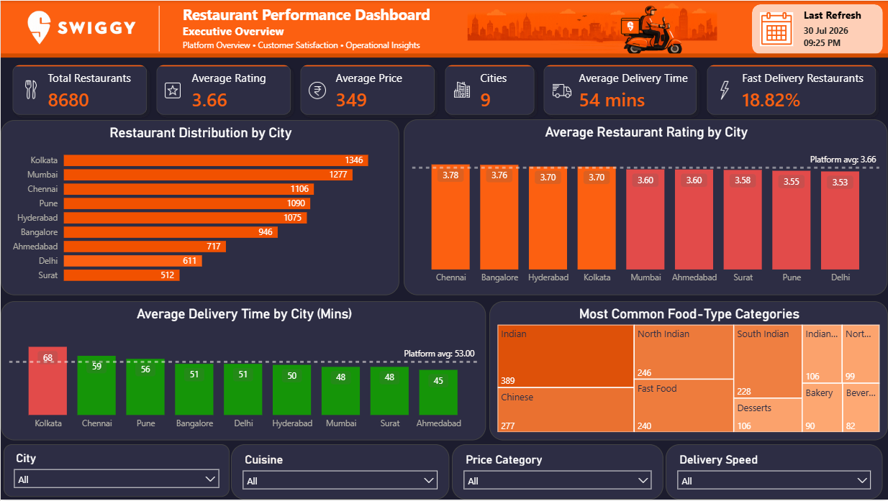
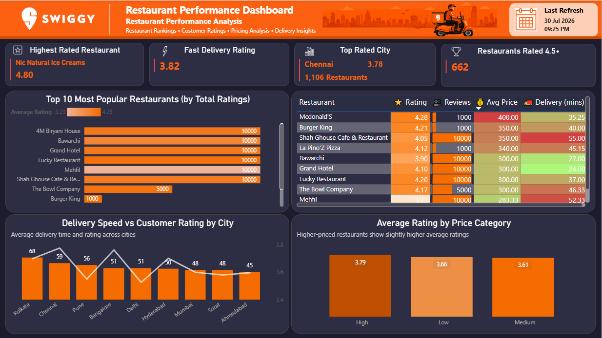

<p align="center">
  
</p>

<p align="center">


</p>

# 🍽️ Swiggy Restaurant Performance & Market Analysis

An end-to-end SQL and Power BI analytics project analyzing 8,680 restaurants across 9 Indian cities using the Swiggy Restaurant Dataset.

The project evaluates restaurant performance, customer ratings, pricing patterns, delivery efficiency, and customer engagement through data quality assessment, exploratory analysis, advanced SQL, statistical analysis, KPI development, and interactive Power BI dashboards.

---

## 📑 Table of Contents

- [Project Overview](#-project-overview)
- [Business Problem](#-business-problem)
- [Business Objectives](#-business-objectives)
- [Dataset Information](#-dataset-information)
- [Tech Stack](#️-tech-stack)
- [Project Workflow](#-project-workflow)
- [Interactive Power BI Dashboards](#-Interactive-Power-BI-Dashboards)
- [Project Highlights](#-project-highlights)
- [Methodology](#-Methodology)
- [Skills Demonstrated](#-skills-demonstrated)
- [Key Business Insights](#-key-business-insights)
- [Business Recommendations](#-business-recommendations)
- [How to Use This Project](#️-how-to-use-this-project)
- [Repository Structure](#-repository-structure)
- [Author](#-author)

## 📖 Project Overview

This project simulates a real-world business case in which Swiggy wants to better understand its restaurant ecosystem.

Using SQL Server, the dataset was cleaned, validated, analyzed, and transformed into actionable business insights through Exploratory Data Analysis (EDA), advanced SQL techniques, KPI development, and business recommendations.

The objective was not only to answer business questions but also to demonstrate how raw data can be converted into meaningful insights for decision-making.

---

## 🎯 Business Problem

Food delivery platforms like Swiggy rely on restaurant quality, pricing, customer satisfaction, and delivery efficiency to maintain customer loyalty and business growth.

However, with thousands of restaurants operating across multiple cities, identifying the factors that influence restaurant performance becomes challenging.

This project aims to analyze restaurant performance using SQL by answering key business questions related to customer ratings, pricing, delivery performance, cuisine preferences, and customer engagement. The goal is to generate actionable insights that can support better business decisions and improve the overall customer experience.

## 🎯 Business Objectives

The project focuses on answering the following business questions:

- Analyze the distribution of restaurants across cities.
- Compare customer ratings across cities and restaurant segments.
- Evaluate the relationship between pricing, ratings, and delivery time.
- Analyze delivery performance across cities.
- Identify high-performing restaurants based on ratings and customer engagement.
- Analyze cuisine-level rating patterns.
- Develop KPIs for restaurant and platform performance.
- Generate evidence-based business recommendations.

## 📊 Dataset Information

| Attribute          | Details                              |
| ------------------ | ------------------------------------ |
| **Dataset Name**   | Swiggy Restaurant Dataset            |
| **Source**         | Kaggle                               |
| **Total Records**  | 8,680                                |
| **Total Features** | 10                                   |
| **Domain**         | Food Delivery / Restaurant Analytics |

### Data Quality Notes

The dataset was assessed for:

- Missing and blank values
- Invalid price values
- Duplicate records
- Rating and delivery-time anomalies

### Dataset Features

| Column        | Description                       |
| ------------- | --------------------------------- |
| ID            | Unique Restaurant ID              |
| Area          | Restaurant Area                   |
| City          | City Name                         |
| Restaurant    | Restaurant Name                   |
| Price         | Average Cost for Two              |
| Avg_ratings   | Average Customer Rating           |
| Total_ratings | Total Number of Customer Ratings  |
| Food_type     | Cuisine Type                      |
| Address       | Restaurant Address                |
| Delivery_time | Estimated Delivery Time (Minutes) |

## 🛠️ Tech Stack

| Category           | Tools Used                          |
| ------------------ | ----------------------------------- |
| Database           | Microsoft SQL Server                |
| SQL IDE            | SQL Server Management Studio (SSMS) |
| Data Analysis      | SQL                                 |
| Data Visualization | Power BI                            |
| Documentation      | Notion                              |
| Version Control    | Git & GitHub                        |
| Code Editor        | Visual Studio Code                  |

## 🔄 Project Workflow

```text
Business Problem
       │
       ▼
Dataset Understanding
       │
       ▼
Data Quality Assessment
       │
       ▼
Exploratory Data Analysis
       │
       ▼
Advanced SQL Analysis
       │
       ▼
Statistical Analysis
       │
       ▼
KPI Development
       │
       ▼
Power BI Dashboards
       │
       ▼
Business Insights
       │
       ▼
Recommendations
```

# 📊 Interactive Power BI Dashboards

The project includes two business-focused Power BI dashboards designed for different stakeholders.

<h2> Dashboard 1 – 📊 Executive Overview Dashboard</h2>

Purpose:
Provides a high-level overview of the Swiggy restaurant ecosystem.

Highlights

- Total Restaurants
- Average Rating
- Average Delivery Time
- Average Price
- Fast Delivery %
- Restaurant Distribution by City
- Cuisine Analysis
- Delivery Performance
- Pricing Insights

<p align="center">
  
</p>

<h2> Dashboard 2 – 🍽️ Restaurant Performance Dashboard </h2>

**Purpose:** Evaluates restaurant performance, customer engagement, delivery efficiency, and pricing patterns.

**Highlights**

- Top-Rated Restaurant
- Fast Delivery Rating
- Top-Rated City
- Restaurants Rated 4.5+
- Top 10 Most Popular Restaurants
- Restaurant Performance Leaderboard
- Delivery Speed vs Customer Rating
- Average Rating by Price Category

<p align="center">
  
</p>

📄 **[View Complete Project Report](docs/Swiggy%20Restaurant%20Performance%20&%20Market%20Analysis.pdf)**

## ⭐ Project Highlights

- Performed data quality assessment covering missing values, invalid prices, and duplicate records.
- Conducted exploratory and advanced SQL analysis across 8,680 restaurant records.
- Used CTEs, window functions, conditional logic, and statistical measures for analysis.
- Evaluated relationships between pricing, ratings, and delivery time using correlation analysis.
- Developed business-focused KPIs and two interactive Power BI dashboards.
- Translated analytical findings into business insights and recommendations.

## 🔬 Methodology

1. **Business Understanding** – Defined the business questions and analytical objectives.

2. **Data Quality Assessment** – Checked missing values, invalid prices, duplicates, and data consistency.

3. **Exploratory Data Analysis** – Analyzed restaurant distribution, ratings, pricing, cuisines, and delivery performance.

4. **Advanced SQL Analysis** – Used CTEs, joins, window functions, ranking, segmentation, and aggregation to answer business questions.

5. **Statistical Analysis** – Evaluated descriptive statistics and correlations between pricing, ratings, and delivery time.

6. **KPI Development** – Defined platform and restaurant performance metrics.

7. **Power BI Development** – Built two interactive dashboards for executive and restaurant-level analysis.

8. **Business Interpretation** – Converted analytical findings into practical recommendations while distinguishing association from causation.

## 🧠 Skills Demonstrated

**SQL:** Data Cleaning, Data Quality Assessment, Joins, CTEs, Window Functions, CASE Statements, Aggregate Functions, Ranking, Exploratory Data Analysis, KPI Development

**Statistics:** Descriptive Statistics, Correlation Analysis, Distribution Analysis

**Power BI:** DAX, Calculated Columns, Data Modeling, Interactive Dashboards, Conditional Formatting, KPI Design, Data Visualization

**Business Analysis:** Business Problem Solving, Performance Analysis, Customer Satisfaction Analysis, Pricing Analysis, Delivery Performance Analysis

**Tools:** SQL Server, SSMS, Power BI Desktop, Git, GitHub

## 📈 Key Business Insights

- **Kolkata** has the highest restaurant concentration with 1,346 restaurants, but also the slowest average delivery time at 68 minutes.

- **Chennai** has the highest city-level average rating at 3.78 across 1,106 restaurants.

- Restaurants with **fast delivery (<40 minutes)** have the highest average rating at 3.82, compared with 3.64 for medium delivery and 3.58 for slow delivery.

- The relationship between **delivery time and rating is weakly negative (r = -0.1467)**, indicating an association rather than a causal effect.

- **High-priced restaurants** have an average rating of 3.79 compared with 3.66 for low-priced and 3.61 for medium-priced restaurants.

- The relationship between **price and rating is weakly positive (r = 0.1135)**, suggesting that price alone is not a strong predictor of customer ratings.

- Customer engagement is concentrated among a relatively small group of highly reviewed restaurants, highlighting the importance of reputation and review volume.

## 💡 Business Recommendations

- **Prioritize delivery efficiency in Kolkata**, where average delivery time is the highest among the analyzed cities.

- **Benchmark high-performing cities such as Chennai** to identify operational practices that could be applied to lower-rated markets.

- **Monitor delivery performance alongside customer ratings**, as faster-delivery segments show higher average ratings, although the relationship is not causal based on this analysis.

- **Avoid relying on price as a primary indicator of customer satisfaction**, given the weak correlation between price and rating.

- **Identify and study high-engagement restaurants** to understand practices associated with stronger customer participation and review volume.

- **Use cuisine-level performance analysis** to identify categories with consistently higher customer ratings and evaluate opportunities for targeted promotion.

## ⚠️ Limitations

- The dataset is a static restaurant-level dataset and does not contain transaction-level order data.
- The analysis is cross-sectional and therefore cannot establish causal relationships.
- Correlation results indicate association, not causation.
- Restaurant ratings and review counts may reflect historical customer behavior and may not represent current performance.
- Duplicate records and invalid price values were assessed during data quality analysis; documented assumptions were retained where the dataset did not provide enough information to determine record validity.
- The dataset does not include customer-level, order-level, or revenue-level information, limiting deeper analysis of customer behavior and financial performance.

## ▶️ How to Use This Project

1. Download the dataset from the `dataset` folder.
2. Import the dataset into Microsoft SQL Server.
3. Execute the SQL scripts in the following order:
   - `01_Data_Quality_Assessment.sql`
   - `02_Exploratory_Data_Analysis.sql`
   - `03_Advanced_Analysis.sql`
   - `04_KPI_Definition.sql`

4. Open the Power BI dashboard (`.pbix`) file to explore the visualizations.
5. Review the complete project documentation in the `docs` folder.

## 📂 Repository Structure

```text
swiggy-restaurant-performance-analysis/
│
├── README.md
├── LICENSE
│
├── docs/
│   └── Swiggy_Restaurant_Performance_Analysis.pdf
│
├── sql/
│   ├── 01_Data_Quality_Assessment.sql
│   ├── 02_Exploratory_Data_Analysis.sql
│   ├── 03_Advanced_Analysis.sql
│   └── 04_KPI_Definition.sql
│
├── dashboard/
│   └── Swiggy_Dashboard.pbix
│
├── dataset/
│   ├── swiggy.csv
│   └── README.md
│
└── images/
    ├── Banner.png
    ├── executive-overview.png
    └── restaurant-performance.png
```

## 👨‍💻 Author

**Rahul Aditya**

MBA (IT & FinTech)

Aspiring Data Analyst

📧 Email: its.rahuladitya@gmail.com

💼 LinkedIn: https://www.linkedin.com/in/rahuladitya10/

🌐 GitHub: https://github.com/adityarahul10
