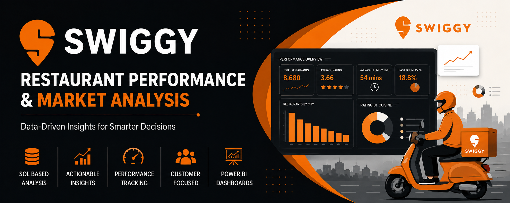
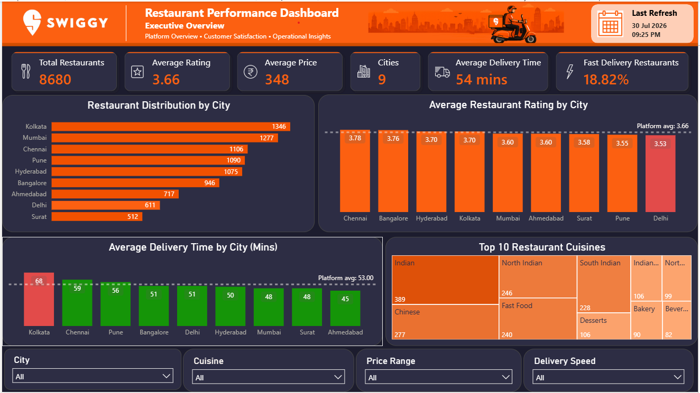
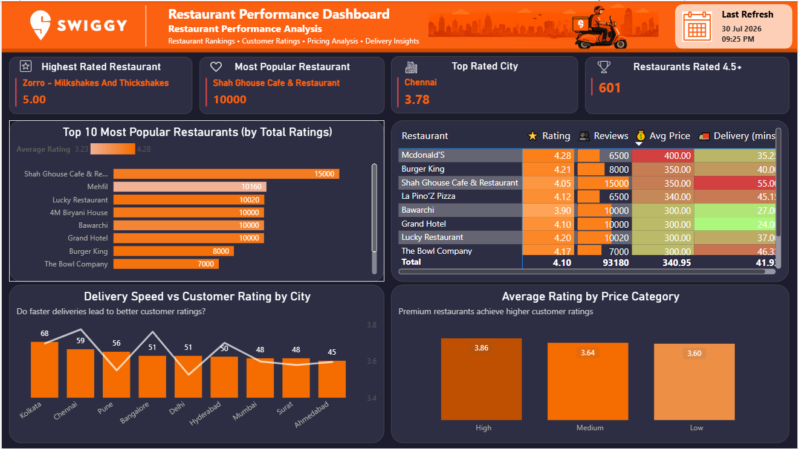

<p align="center">
  
</p>

<p align="center">


</p>

# 🍽️ Swiggy Restaurant Performance & Market Analysis

An end-to-end SQL Data Analytics project that analyzes restaurant performance across multiple Indian cities using the Swiggy Restaurant Dataset.

The project focuses on identifying the factors influencing customer satisfaction, restaurant performance, pricing strategy, delivery efficiency, and customer engagement through SQL-based analysis and business storytelling.

---

## 📑 Table of Contents

- [Project Overview](#-project-overview)
- [Business Problem](#-business-problem)
- [Business Objectives](#-business-objectives)
- [Dataset Information](#-dataset-information)
- [Tech Stack](#️-tech-stack)
- [Project Workflow](#-project-workflow)
- [Repository Structure](#-repository-structure)
- [Interactive Power BI Dashboards](#-Interactive-Power-BI-Dashboards)
- [Project Highlights](#-project-highlights)
- [Methodology](#-Methodology)
- [Skills Demonstrated](#-skills-demonstrated)
- [Key Business Insights](#-key-business-insights)
- [Business Recommendations](#-business-recommendations)
- [How to Use This Project](#️-how-to-use-this-project)
- [Author](#-author)

## 📖 Project Overview

This project simulates a real-world business case in which Swiggy wants to better understand its restaurant ecosystem.

Using SQL Server, the dataset was cleaned, validated, analyzed, and transformed into actionable business insights through Exploratory Data Analysis (EDA), advanced SQL techniques, KPI development, and business recommendations.

The objective was not only to answer business questions but also to demonstrate how raw data can be converted into meaningful insights for decision-making.

---

## 🎯 Business Problem

Food delivery platforms like Swiggy rely on restaurant quality, pricing, customer satisfaction, and delivery efficiency to maintain customer loyalty and business growth.

However, with thousands of restaurants operating across multiple cities, identifying the factors that influence restaurant performance becomes challenging.

This project aims to analyze restaurant performance using SQL by answering key business questions related to customer ratings, pricing, delivery performance, cuisine preferences, and customer engagement. The goal is to generate actionable insights that can support better business decisions and improve the overall customer experience.

## 🎯 Business Objectives

The project focuses on answering the following business questions:

- Analyze the distribution of restaurants across different cities.
- Identify cities with the highest restaurant concentration.
- Compare customer satisfaction across cities.
- Analyze pricing patterns and their relationship with ratings.
- Evaluate delivery performance across cities and areas.
- Identify top-performing restaurants based on customer ratings and engagement.
- Discover the factors that influence customer satisfaction.
- Generate actionable business recommendations based on data.

## 📊 Dataset Information

| Attribute          | Details                              |
| ------------------ | ------------------------------------ |
| **Dataset Name**   | Swiggy Restaurant Dataset            |
| **Source**         | Kaggle                               |
| **Total Records**  | 8,680                                |
| **Total Features** | 10                                   |
| **Domain**         | Food Delivery / Restaurant Analytics |

### Dataset Features

| Column        | Description                       |
| ------------- | --------------------------------- |
| ID            | Unique Restaurant ID              |
| Area          | Restaurant Area                   |
| City          | City Name                         |
| Restaurant    | Restaurant Name                   |
| Price         | Average Cost for Two              |
| Avg_ratings   | Average Customer Rating           |
| Total_ratings | Total Number of Customer Ratings  |
| Food_type     | Cuisine Type                      |
| Address       | Restaurant Address                |
| Delivery_time | Estimated Delivery Time (Minutes) |

## 🛠️ Tech Stack

| Category           | Tools Used                          |
| ------------------ | ----------------------------------- |
| Database           | Microsoft SQL Server                |
| SQL IDE            | SQL Server Management Studio (SSMS) |
| Data Analysis      | SQL                                 |
| Data Visualization | Power BI                            |
| Documentation      | Notion                              |
| Version Control    | Git & GitHub                        |
| Code Editor        | Visual Studio Code                  |

## 🔄 Project Workflow

```text
Business Problem
        │
        ▼
Dataset Understanding
        │
        ▼
Data Quality Assessment
        │
        ▼
Exploratory Data Analysis (EDA)
        │
        ▼
Advanced SQL Analysis
        │
        ▼
KPI Development
        │
        ▼
Business Insights
        │
        ▼
Business Recommendations
        │
        ▼
Power BI Dashboard
```

# 📊 Interactive Power BI Dashboards

The project includes two business-focused Power BI dashboards designed for different stakeholders.

## Dashboard 1 – <h2>📊 Executive Overview Dashboard</h2>

Purpose:
Provides a high-level overview of the Swiggy restaurant ecosystem.

Highlights
• Total Restaurants
• Average Rating
• Average Delivery Time
• Average Price
• Fast Delivery %
• Restaurant Distribution by City
• Cuisine Analysis
• Delivery Performance
• Pricing Insights

<p align="center">
  
</p>

## Dashboard 2 – <h2>🍽️ Restaurant Performance Dashboard</h2>

Purpose:
Helps identify the best-performing restaurants and customer engagement patterns.

Highlights

• Highest Rated Restaurant
• Most Popular Restaurant
• Top Rated City
• Restaurants Rated 4.5+
• Top 10 Most Popular Restaurants
• Restaurant Performance Leaderboard
• Delivery Speed vs Customer Rating
• Rating by Price Category

<p align="center">
  
</p>

## ⭐ Project Highlights

- ✔ Performed comprehensive Data Quality Assessment before analysis.
- ✔ Conducted Exploratory Data Analysis (EDA) to answer key business questions.
- ✔ Used Advanced SQL techniques including CTEs and Window Functions.
- ✔ Developed business-focused KPIs to measure platform performance.
- ✔ Performed statistical analysis using mean, median, and standard deviation.
- ✔ Identified factors influencing customer satisfaction.
- ✔ Generated actionable business recommendations.
- ✔ Designed as an end-to-end Data Analytics case study.

## 🔬 Methodology

- **Business Understanding** – Defined the business problem and objectives.
- **Data Quality Assessment** – Identified and cleaned missing, duplicate, and invalid records.
- **Exploratory Data Analysis** – Analyzed ratings, pricing, cuisines, and delivery performance using SQL.
- **KPI Development** – Created business KPIs to measure restaurant performance.
- **Dashboard Development** – Built two interactive Power BI dashboards.
- **Business Insights** – Generated actionable insights and recommendations.

## 🧠 Skills Demonstrated

**SQL:** Data Cleaning, Data Quality Assessment, Joins, CTEs, Window Functions, Aggregate Functions, CASE Statements, Exploratory Data Analysis (EDA), KPI Development

**Power BI:** DAX, Calculated Columns, Data Modeling, Interactive Dashboards, KPI Design, Conditional Formatting, Data Visualization

**Business Analysis:** Business Problem Solving, Business Insights, Restaurant Performance Analysis, Customer Satisfaction Analysis, Pricing Analysis, Delivery Performance Analysis

**Tools:** SQL Server, Power BI Desktop, Git, GitHub

## 📈 Key Business Insights

- 📍 Kolkata has the highest restaurant concentration but also the slowest average delivery time.
- ⭐ Chennai achieved the highest average customer rating among all cities.
- 🚚 Faster deliveries are associated with higher customer ratings.
- 💰 Premium-priced restaurants consistently received better customer ratings.
- 🍦 Specialty food brands (Ice Cream, Bakery, Coffee, Desserts) significantly outperformed mass-market cuisines.
- ❤️ Hyderabad generated the highest customer engagement despite having fewer restaurants than Kolkata.
- 📊 Customer ratings remained relatively consistent, while restaurant pricing showed high variability.

## 💡 Business Recommendations

Based on the analysis, the following recommendations are proposed:

- 🚚 Improve delivery efficiency in Kolkata to reduce delivery time and enhance customer satisfaction.
- 🍦 Increase the visibility of high-performing specialty food categories such as Ice Cream, Bakery, Coffee, and Desserts.
- ⭐ Encourage restaurants to achieve faster delivery through operational improvements and delivery partner optimization.
- 📚 Study operational practices of top-performing restaurants and replicate successful strategies across lower-performing restaurants.
- 🌆 Replicate Chennai's operational success in cities with lower customer satisfaction.
- 📈 Focus business expansion on high-engagement markets such as Hyderabad.

## ▶️ How to Use This Project

1. Download the dataset from the `dataset` folder.
2. Import the dataset into Microsoft SQL Server.
3. Execute the SQL scripts in the following order:
   - `01_Data_Quality_Assessment.sql`
   - `02_Exploratory_Data_Analysis.sql`
   - `03_Advanced_Analysis.sql`
   - `04_KPI_Definition.sql`

4. Open the Power BI dashboard (`.pbix`) file to explore the visualizations.
5. Review the complete project documentation in the `docs` folder.

## 📁 Repository Structure

```text
swiggy-restaurant-performance-analysis/
│
├── 📄 README.md
│
├── 📂 docs
│   └── Swiggy_Restaurant_Performance_Analysis.pdf
│
├── 📂 sql
│   ├── 01_Data_Quality_Assessment.sql
│   ├── 02_Exploratory_Data_Analysis.sql
│   ├── 03_Advanced_Analysis.sql
│   └── 04_KPI_Definition.sql
│
├── 📂 dashboard
│   ├── Swiggy_Dashboard.pbix
│   └── Dashboard_Screenshot.png
│
├── 📂 dataset
│   └── Swiggy_Restaurant_Dataset.csv
│
└── 📂 images
    ├── cover.png
    ├── workflow.png
    └── dashboard.png
```

## 👨‍💻 Author

**Rahul Aditya**

MBA (IT & FinTech)

Aspiring Data Analyst

📧 Email: its.rahuladitya@gmail.com

💼 LinkedIn: https://www.linkedin.com/in/rahuladitya10/

🌐 GitHub: https://github.com/adityarahul10
